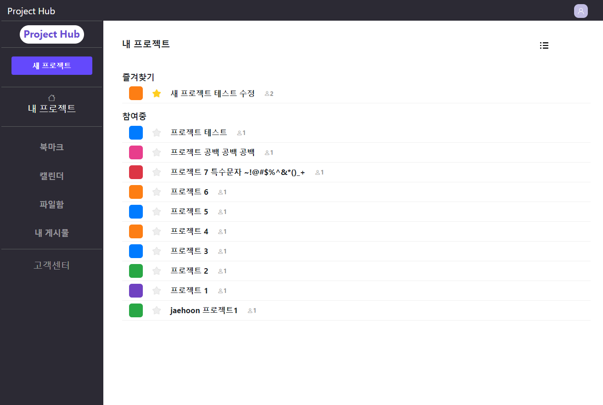
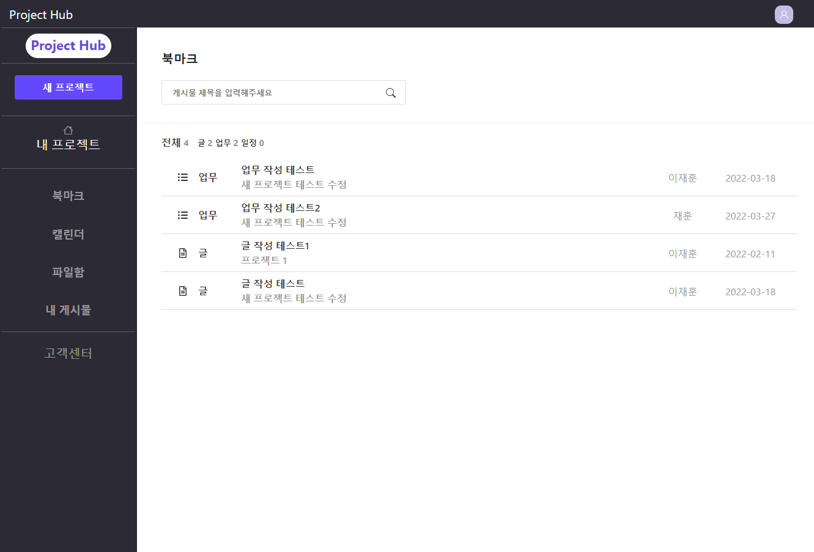
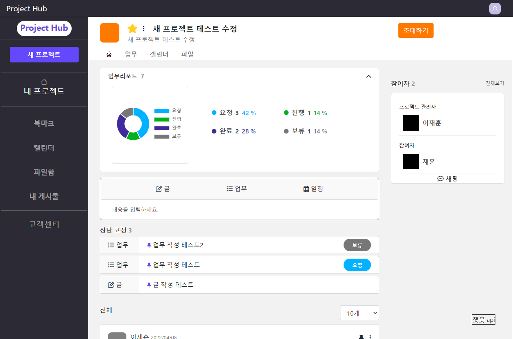
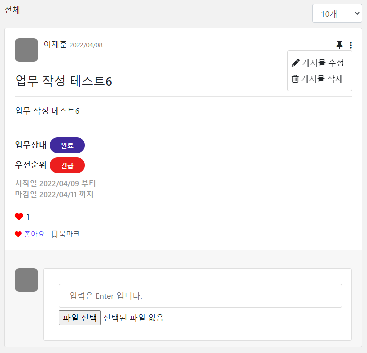

-Spring Project-
----------------
### 우리가 함께 일하는 법, Project Hub

## 사이트 목적 
[프로젝트 계획과 업무를 쉽게 공유하고 정리하며  프로젝트의 목표를 달성하는데 시각적인 도움을 주기 위한 웹 사이트]

## 개발환경 및 사용기술 
> Spring 5.0.7.RELEASE, MyBatis, BootStrap4.6, Apache Tomcat9.0, Oracle 11g, eXERD 
> java, HTML5, css, javascript, jquery, json, jsp, xml

## 주요 화면 캡쳐 

<h3 align="center">Main Page</h3>

 

<h3 align="center">BookMark Page</h3>

 

<h3 align="center">Project Home Page</h3>

 

<h3 align="center">Board</h3>

 

